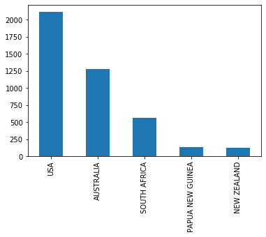
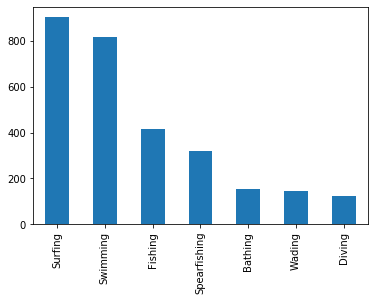
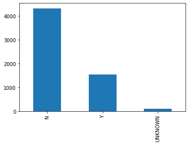
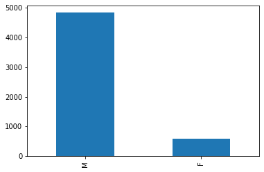
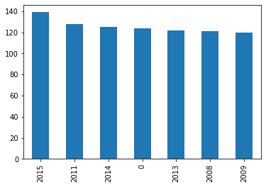
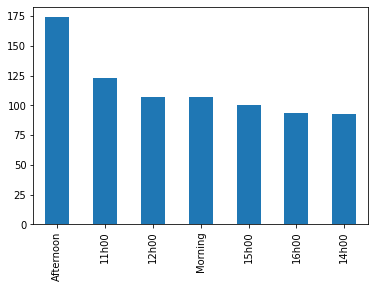

# Project: Data Cleaning and Manipulation with Pandas

## Overview

The goal of this project is to combine everything you have learned about data wrangling, cleaning, and manipulation with Pandas so you can see how it all works together. For this project, you will start with this messy data set [Shark Attack](https://www.kaggle.com/teajay/global-shark-attacks/version/1). You will need to import it, use your data wrangling skills to clean it up, prepare it to be analyzed, and then export it as a clean CSV data file.

## Steps

## Encoding y columnas eliminadas

Lo primero que realicé al descargarme el dataset, fue importarlo. Al tener un tipo de encoding diferente no se podía importar. Lo solucioné buscando el error y utilicé una de las respuestas que sugería cambiar el encoding a "ISO-8859-1". Posteriormente también encontré que se puede poner engine="python" y soluciona el error de la misma manera. 

Una vez dentro, cambié las opciones de Pandas para poder mostrar más columnas y filas para que pudiese ver la mayor cantidad posible de datos. Ahora empieza la limpieza:

Para empezar imprimí las columnas y la suma de valores perdidos para poder ir descartando columnas que no fuesen necesarias. De este modo, pude descartar inmediatamente las columnas de "Unnamed : 22" y "Unnamed: 23" ya que no tenían ningún valor.

Al imprimir el dataframe, observé que las columnas de "Case Number.1" y "Case Number.2" eran columnas repetidas con el mismo valor que "Case Number". Además, las columnas de "href formula" y "href" se podían derivar de los datos del pdf ya que contenian la URL genérica "http://sharkattackfile.net/spreadsheets/pdf_directory/" + el nombre del PDF.

## Age, Sex and Fatality

Una vez eliminadas las columnas sobrantes, observé que de alguna manera se podían arreglar los missing values de las columnas Age, Sex y Fatality.

Empecé con Age y al imprimir los valores de la columna me di cuenta que, a parte de los más de 2000 NaN, tenía algunos strings que me impedían sacar la media. Por ello fui modificándolos y reemplazándolos por valores enteros. Una vez hecho esto, realicé la media y le coloqué dicha cifra a los valores NaN, provocando que al dibujar la gráfica se vea un boom de ataques a personas con 30 años.

En cuanto al sexo no fue muy complicado ya que realicé el mismo procedimiento y modifiqué para que solo quedasen Masculinos y Femeninos.

En cuanto a la fatalidad, los valores fueron modificados para que quedasen valores de Si/No o Unknown.

## Conclusiones

Para poder sacar algunas conclusiones, decidí hacer plots de las columnas más importantes.

* ** Countries: Los 5 países con más ataques de tiburones son USA, Australia, South Africa, New Guinea y New Zealand.

* ** Ages: Como se comentó anteriormente, el valor de los 30 años subió muchó debido a que habían muchos NaN. La media da en la edad de los 28, pero se ve que hay muchos ataques entre los 15 y los 20 años.

* ** Activity: Como se puede observar en la gráfica, las actividades con más ataques son las del surf y el nado, seguida por la pesca.

* ** Fatality: Por suerte, la mayoría de los ataques registrados han sido mordeduras que no han supuesto la muerte a la persona (+4000).

* ** Sex: La cifra de incidentes a mujeres es ínfima comparada con la de los hombres.

* ** Years: La mayoria de ataques registrados son recientes. Aunque se pudo observar en el dataset que habían ataques muy viejos que datan del 1500 o incluso antes, la mayoría son a partir de la segunda guerra mundial, teniendo muchos más registros a partir del 2000. Se puede observar que hay ataques en el año 0, esto es debido a que no se sabe cuándo tuvo lugar.

* ** Time: Por último, aunque hay muchos registros que no tienen la hora asignada, se puede observar como la mayoría de los casos han sido entre las 12 y las 16 horas. Hora de almorzar!

