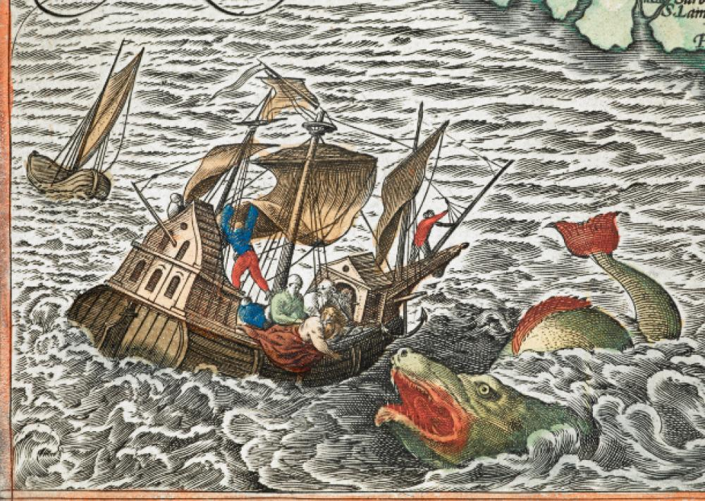

# Project: The Dangers of World Exploration by Sea: The empire of Sharks

## Overview

As we know, during the Age of Discovery from the 15th to the 17th centuries, humanity began exploring the oceans and reached many new lands around the globe. Most of those discoveries and the beginning of globalization would not have been possible without the work and brave spirit of sailors from the Old World, who left their homes to fight many dangers, known and unknown, for the glory and power of their native empires.

In this analysis, we will look at one of those dangers, the scariest of sea monsters, the shark. Whether walking the plank on the hands of a mighty pirate or kite surfing in sunny California, many a man lost their lives to an attack from one of these vicious creatures. 

Can we find a relation, though, between these attacks and the zones conquered by the largest european empires? Let's look through the data and find out if sharks are particularly hungry or deadly in one of those territories.

---

## Data processing

In this project we will be analyzing the [Shark Attack data](https://www.kaggle.com/teajay/global-shark-attacks/version/1) from a CSV file which can be downloaded from Kaggle. If you want to try it for yourself, the file should be added to the input folder on repository (your-code/input).
We will go through the data frame step by step in order to clean and organize the data so we can acquire the relevant information to verify our hypothesis. Each step is commented and easy to follow.
Feel free to change, try out new points of view and research new hypotheses on the theme.

## Resources

* [Pandas Documentation](https://pandas.pydata.org/pandas-docs/stable/)
* [Pandas Tutorials](https://pandas.pydata.org/pandas-docs/stable/tutorials.html)
* [StackOverflow Pandas Questions](https://stackoverflow.com/questions/tagged/pandas)
* [Awesome Public Data Sets](https://github.com/awesomedata/awesome-public-datasets)
* [Kaggle Data Sets](https://www.kaggle.com/datasets)

This project is part of the Ironhack Data Analytics Bootcamp.